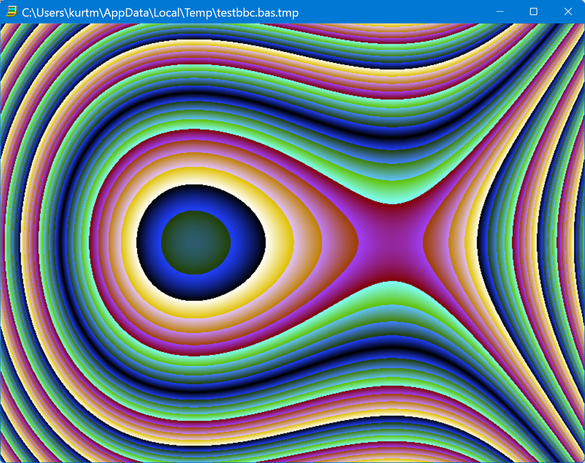
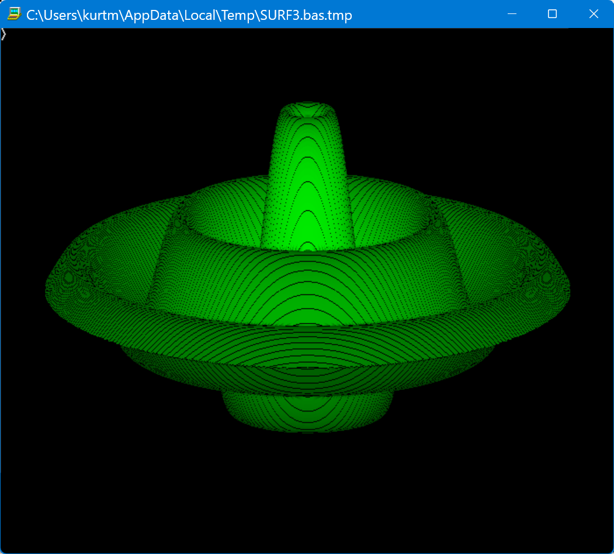
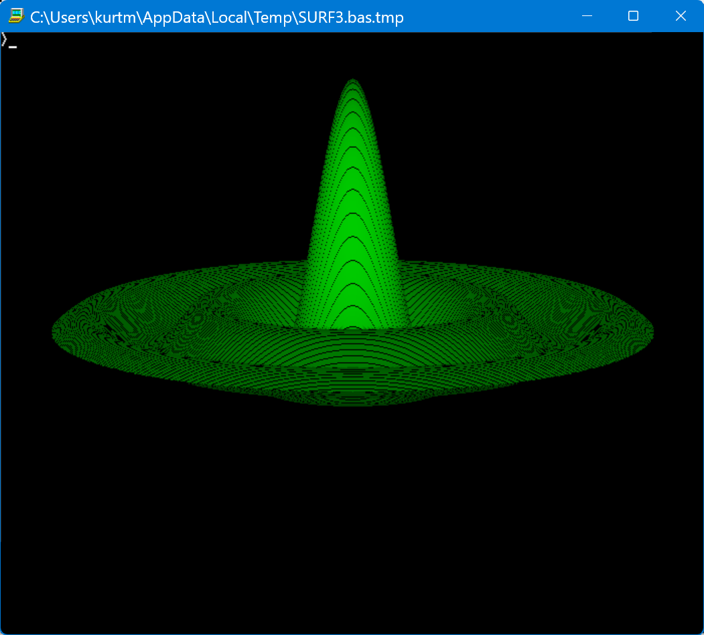
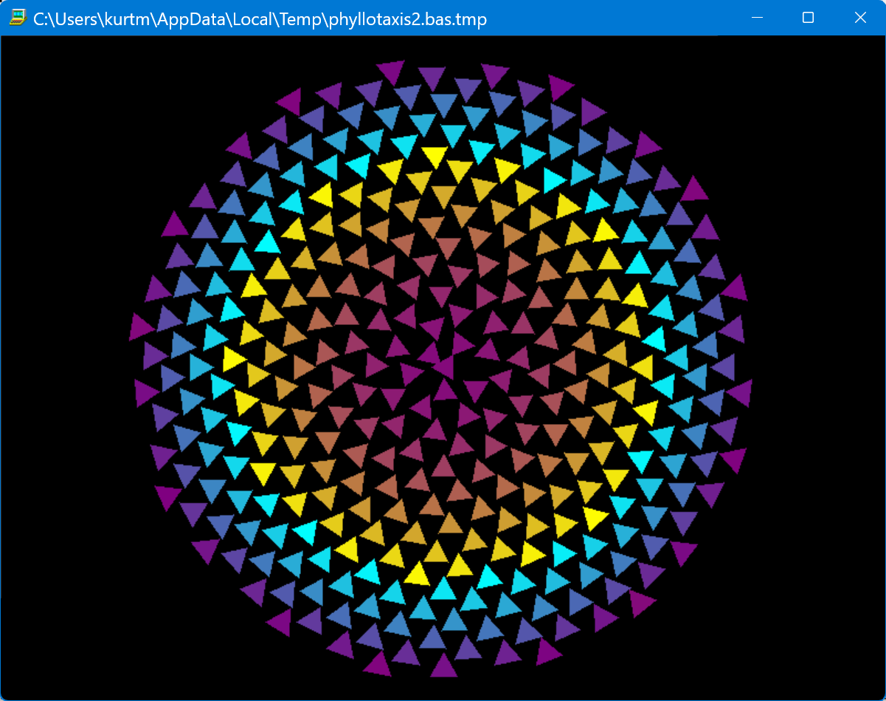
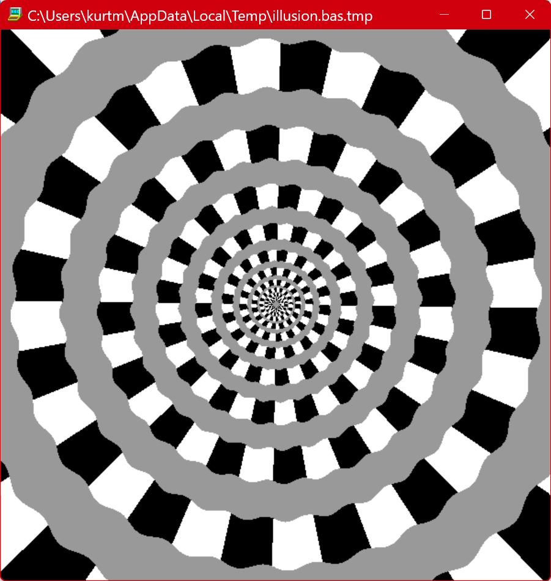
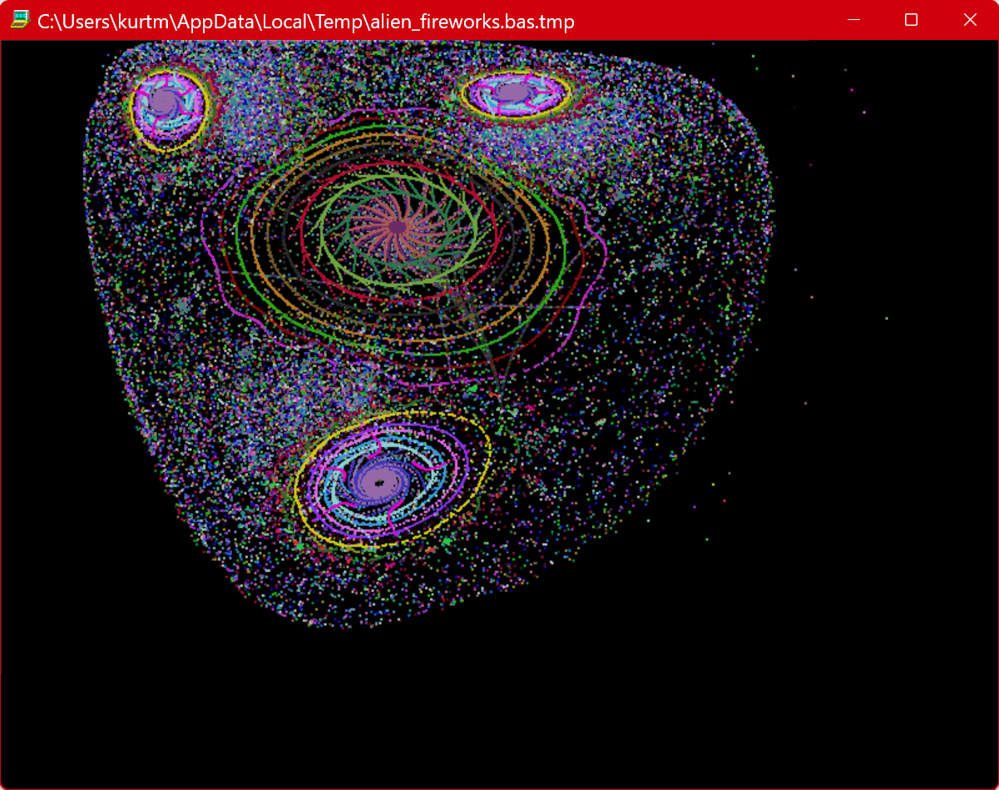

# BBC BASIC for SDL

Exploring the latest [modern incarnation of BBC BASIC](https://www.bbcbasic.co.uk/bbcsdl/index.html)

## First test

First test of BBC BASIC generating a colorfull pattern

      REM First test of BBC BASIC for SDL  K Moerman 2026
      REM set parameters, % for integer vars, # for floating point vars
      W% = 800 : HW% = W% DIV 2
      H% = 600 : HH% = H% DIV 2
      REM define an user-defined display mode
      VDU 23, 22, W%; H%; 8, 16, 16, 0
      REM move coord 0,0 to center, uses graphical units not pixels
      ORIGIN W%, H%
      REM set foreground logical colour
      GCOL 1
      REM loop through pixels
      FOR X% = -HW% TO HW%
        XX# = 0.85 * X%
        FXX# = 2.5E-5 * XX#^3 - XX# REM pre-calc this, only depends on X
        FOR Y% = -HH% TO HH%
          YY# = 0.85 * Y% + 150
          D% = INT(ABS(FXX#  + 3 * YY# - 1E-2 * YY# * YY#))
          R% = D% MOD 256 REM derive rgb values from D%
          G% = (D% MOD 128) * 2
          B% = (D% MOD 32) * 8
          REM change logical colour 1 to new physical colour using r,g,b components
          COLOUR 1, R%, G%, B%
          REM DRAW the pixel, commands use Graphics units not pixel coordinates
          MOVE 2*X%, 2*Y%  : DRAW 2*X%, 2*Y%
        NEXT
      NEXT
      OFF: WHILE INKEY$(2) = "": ENDWHILE REM wait for key press to show cursor
      END

The code as file: [testbbc.bas](testbbc.bas)

Output:

## Surface plot with hidden-line removal

2D Surface plot with hidden-lines removal, the surface color varies with the local increase in Y value.

The code [SURF.bas](SURF.bas)

## Vogel's formula from Phyllotaxis 

A animation using Vogel's formula, to learn more about using BBC BASIC and graphical output.

    angle = n * 137,5°
    r = c * √n

The program draws 3 different shapes, their position is determined by the Vogel's formula. The colors are animated.

The code: [phyllotaxis2.bas](phyllotaxis2.bas)

[Watch the animation on Youtube](https://youtu.be/6VG5WaerftE?is=w6frz9UIjpC5zbg8)

A still image from the animation:

## Spiral Illusion 
 

Based on an [image posted by Akiyoshi Kitaoka on FB which consists of concentric circles but can give the illusion that there is one spiral growing from the center](https://www.facebook.com/share/p/1QEpNj9kjW/)

(Here only the built-in graphical commands are used, not the more powerful libraries that come with this latest version of BBC BASIC.)

The code resides here: 

[illusion.bas](illusion.bas)

## Alien Fireworks

This program uses 2 coupled sine map formulas to calculate successive x and y coordinates. 

The formulas have two parameters a and b which are being varied.

    Xn+1 = sin(Xn² - Yn² + a)
    Yn+1 = sin(2.Xn.Yn + b)

The parts Xn² - Yn² and 2.Xn.Yn can be reckognised as the real and imaginary part of a squared complex number Z=X+i.Y

The code: [alien_fireworks.bas](alien_fireworks.bas)

This second version uses the library "gfxlib - A 2D Game Graphics Library for BBCSDL" for all graphic output intead off the buolt in commands of BBC BASIC.

The code of the gfxlib version: [alien_fireworks_gfxlib.bas](alien_fireworks_gfxlib.bas)

[View the animation on Youtube](https://youtu.be/J6y3kliobfI)

A stilll image from the animation:

